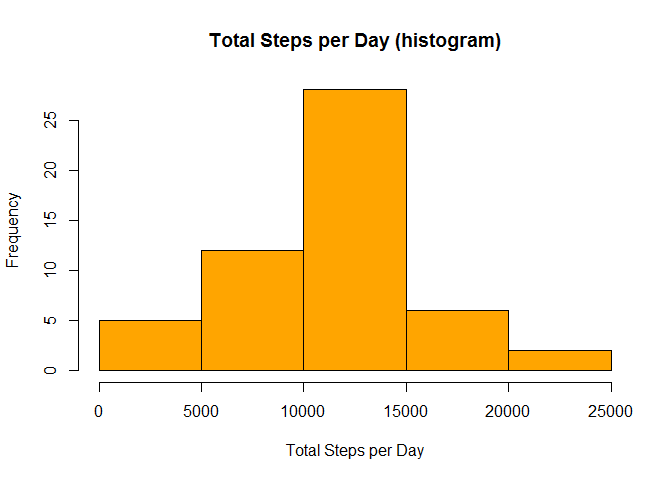
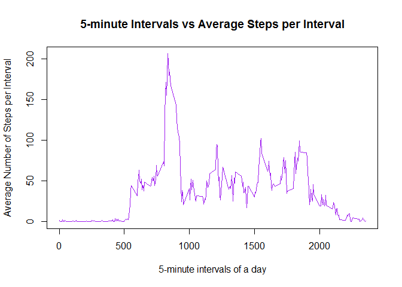
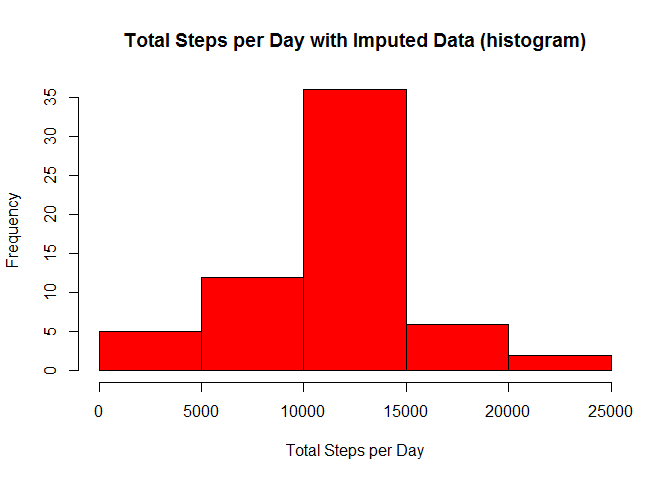
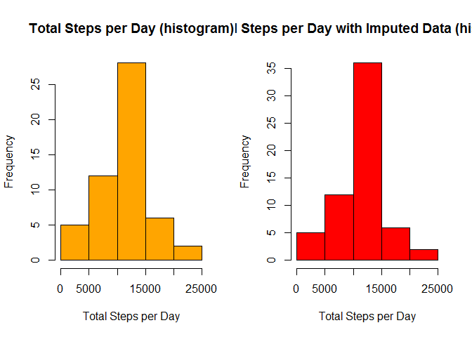
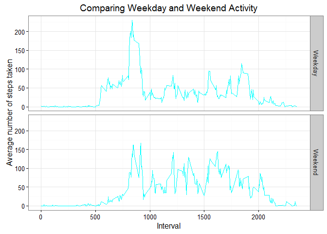

# RepRes_Assign1
EduardoAbreu  
March 6, 2016  
===============================================================
#1. Loading and preprocessing the data

###Loading, and installing if needed, packages that will be used

```r
if(!require(dplyr)) {
  install.packages("dplyr")
  library(dplyr)  
}
```

```
## Loading required package: dplyr
```

```
## 
## Attaching package: 'dplyr'
```

```
## The following objects are masked from 'package:stats':
## 
##     filter, lag
```

```
## The following objects are masked from 'package:base':
## 
##     intersect, setdiff, setequal, union
```

```r
if(!require(ggplot2)) {
  install.packages("ggplot2")
  library(ggplot2)  
}
```

```
## Loading required package: ggplot2
```

```
## Warning: package 'ggplot2' was built under R version 3.2.3
```

```r
if(!require(reshape2)) {
  install.packages("reshape2")
  library(reshape2)
}
```

```
## Loading required package: reshape2
```

```r
if(!require(chron)) {
  install.packages("chron")
  library(chron)
}
```

```
## Loading required package: chron
```

```
## Warning: package 'chron' was built under R version 3.2.3
```

###Downloading the data and reading it into R


```r
fileURL <- "https://d396qusza40orc.cloudfront.net/repdata%2Fdata%2Factivity.zip"
download.file(fileURL, "activity_data.zip")
unzip("activity_data.zip")

data <- read.csv("activity.csv", na.strings = "NA")
```

###Setting the correct date format so that data manipulation can happen


```r
data$date <- as.Date(data$date)
```

============================================================
#2. What is mean total number of steps taken per day?
##For this part of the assignment, you can ignore the missing values in the dataset.

###Using only complete cases


```r
complete_data <- data[complete.cases(data),]
```

###Change the data format into table-dataframe required by dplyr to function best. Once in the right format, can then use "group_by"" and "summarize" from dplyr to aggregate the date by day and then sum the total steps per day.


```r
mani_data <- tbl_df(complete_data)
day_step <- group_by(mani_data, date)
day_step_tot <- summarize(day_step, DaySteps = sum(steps))

hist(day_step_tot$DaySteps, col = "orange", main = "Total Steps per Day (histogram)",
     xlab = "Total Steps per Day")
```

<!-- -->

###As we were also asked to provide the mean and median for total steps taken:


```r
avg_tot_step <- mean(day_step_tot$DaySteps, na.rm = TRUE)
print(c("Average Total Steps per Day", avg_tot_step))
```

```
## [1] "Average Total Steps per Day" "10766.1886792453"
```

```r
median_tot_step <- median(day_step_tot$DaySteps, na.rm = TRUE)
print(c("Median Total Steps per Day", median_tot_step))
```

```
## [1] "Median Total Steps per Day" "10765"
```
=========================================================
#3. What is the average daily activity pattern?

###Similar to above, will be using dplyr's "group_by" and "summarize" to manipulate the data but instead of grouping on days, we are grouping on interval, and instead of generating a sum total, we are calculating an average (aka the mean).


```r
daily_pattern <- group_by(mani_data, interval)
daily_pattern_avg <- summarize(daily_pattern, IntervalAvg = mean(steps))
```

###As per the assignment, now we generate a plot of type = "l" in order to visualize the most active intervals during a day.

```r
plot(x = daily_pattern_avg$interval, y = daily_pattern_avg$IntervalAvg, type = "l", col = "purple", xlab = "5-minute intervals of a day", ylab = "Average Number of Steps per Interval", main = "5-minute Intervals vs Average Steps per Interval")
```

<!-- -->

###As we were also asked to identify "Which 5-minute interval, on average across all the days in the dataset, contains the maximum number of steps?"


```r
max_avg_interval_value <- max(daily_pattern_avg$IntervalAvg, na.rm = TRUE)
max_interval <- daily_pattern_avg$interval[daily_pattern_avg$IntervalAvg == max_avg_interval_value]

print(c("The interval that on average, across all days, has the highest number of steps is interval", max_interval))
```

```
## [1] "The interval that on average, across all days, has the highest number of steps is interval"
## [2] "835"
```

===========================================================
#4. Imputing missing values

###Given that missing values may introduce some bias into the calculations, let's see how many missing values are present in the steps column of the original dataset and see what percentage of the data they represent. We are also creating a new dataframe where we can replace missing values.  This dataframe, data_for_imputing, starts off as a copy of the raw data.


```r
data_for_imputing <- data
data_for_imputing <- tbl_df(data_for_imputing) 
sum_of_missing <- sum(!complete.cases(data_for_imputing$steps))
total_number_observations <- length(data_for_imputing$steps)
pct_missing <- round(100*(sum_of_missing/total_number_observations),2)

print(c("There are", sum_of_missing, "missing observations for steps"))
```

```
## [1] "There are"                      "2304"                          
## [3] "missing observations for steps"
```

```r
print(c("Missing values account for", pct_missing, "% of the dataset (rounded to 2 significant digits"))
```

```
## [1] "Missing values account for"                       
## [2] "13.11"                                            
## [3] "% of the dataset (rounded to 2 significant digits"
```

###So how should we deal with the missing values? We could either substitute the NAs with the mean, the median, or the mode.  I have elected to use the mean value for the corresponding interval when substituting. At the end of this next segment, the data_for_imputing dataframe will not have any missing values.  


```r
for(i in 1:total_number_observations){
  if(is.na(data_for_imputing$steps[i])){
    interval_for_replacement <- data_for_imputing$interval[i]
    data_for_imputing$steps[i] <- daily_pattern_avg$IntervalAvg[daily_pattern_avg$interval == interval_for_replacement]
  }
}
```

###Now, did imputing this data alter the outcome of the assessments conducted earlier when the missing values were ignored?


```r
imputed_day_step_grouped <- group_by(data_for_imputing, date)
imputed_day_step_tot <- summarize(imputed_day_step_grouped, DaySteps = sum(steps))

hist(imputed_day_step_tot$DaySteps, col = "red", main = "Total Steps per Day with Imputed Data (histogram)",
     xlab = "Total Steps per Day")
```

<!-- -->

###Let's also see if the summary statistics calculated earlier have changed due to the imputing...


```r
avg_tot_step_imputed <- mean(imputed_day_step_tot$DaySteps, na.rm = TRUE)
print(c("Average Total Steps per Day with Imputed Data", avg_tot_step_imputed, "Which compares to",avg_tot_step))
```

```
## [1] "Average Total Steps per Day with Imputed Data"
## [2] "10766.1886792453"                             
## [3] "Which compares to"                            
## [4] "10766.1886792453"
```

```r
median_tot_step_imputed <- median(imputed_day_step_tot$DaySteps, na.rm = TRUE)
print(c("Median Total Steps per Day with Imputed Data", median_tot_step_imputed, "Which compares to", median_tot_step))
```

```
## [1] "Median Total Steps per Day with Imputed Data"
## [2] "10766.1886792453"                            
## [3] "Which compares to"                           
## [4] "10765"
```

### It would probably be helpful to visualize the two histograms side by side


```r
par(mfrow = c(1, 2))
hist(day_step_tot$DaySteps, col = "orange", main = "Total Steps per Day (histogram)",
     xlab = "Total Steps per Day")
hist(imputed_day_step_tot$DaySteps, col = "red", main = "Total Steps per Day with Imputed Data (histogram)",
     xlab = "Total Steps per Day")
```

<!-- -->

==============================================================

#5. Are there differences in activity patterns between weekdays and weekends?

###First we need to add an indicator as to whether or not a given date is weekend. Here we will make use of the chron package.


```r
data_for_imputing$DayType <- is.weekend(data_for_imputing$date)
```

###Now we should have a new column that shows FALSE for weekdays and TRUE for weekends. But given that we need them to read weekday/weekend, we need to replace them and convert them into factor class.


```r
data_for_imputing$DayType <- as.factor(ifelse(data_for_imputing$DayType == TRUE, "Weekend", "Weekday"))
```

###In order to assess the difference between activity intensity weekdays/weekdays, let's group the data by Interval and Weekend/Weekday, and then let's plot it.


```r
melted <- melt(data_for_imputing, id = c("interval", "DayType"), measure.vars = c("steps"))
cast <- dcast(melted, interval + DayType ~ variable, mean)

q <- ggplot(aes(x = interval, y = steps), data = cast)
q + geom_line(colour = "cyan") + ggtitle("Comparing Weekday and Weekend Activity")+ labs(x = "Interval")+ labs(y = "Average number of steps taken")+ facet_grid(DayType ~ .) + theme_bw()
```

<!-- -->


